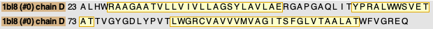
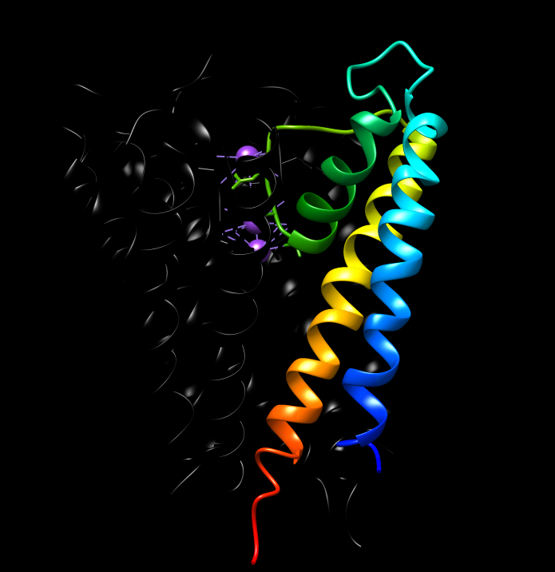
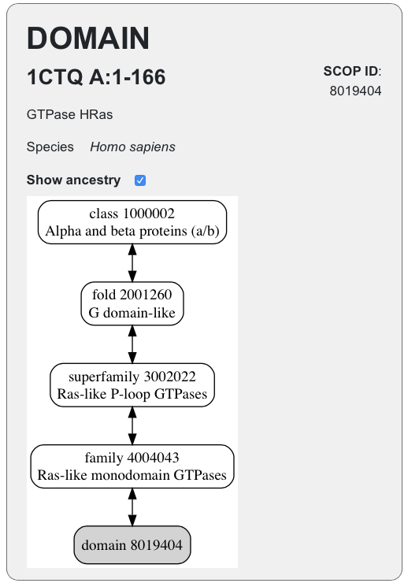
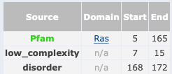

 <head>
    <meta charset="utf-8">
    <title>{{ page.title }}</title>
<script src="https://cdn.jsdelivr.net/npm/babel-polyfill/dist/polyfill.min.js"></script>
    <!-- Web component polyfill (only loads what it needs) -->
<script src="https://cdn.jsdelivr.net/npm/@webcomponents/webcomponentsjs/webcomponents-lite.js" charset="utf-8"></script>
    <!-- Required to polyfill modern browsers as code is ES5 for IE... -->
<script src="https://cdn.jsdelivr.net/npm/@webcomponents/webcomponentsjs/custom-elements-es5-adapter.js" charset="utf-8"></script>

<link rel="stylesheet" type="text/css" href="https://www.ebi.ac.uk/pdbe/pdb-component-library/css/pdbe-molstar-1.2.1.css">
<script type="text/javascript" src="https://www.ebi.ac.uk/pdbe/pdb-component-library/js/pdbe-molstar-component-1.2.1.js"></script>
<style>
        #myViewer{
          float:none;
          width:400px;
          height:400px;
          position:relative;
        }
    </style>
  </head>

<h1> Anàlisi de les relacions seqüència-estructura-funció del canal iònic de potassi  (PDB: 1BL8)</h1>

- [Estructura secundària guai](#estructura-secundària-guai)
- [Estructura supersecundària](#estructura-supersecundària)
- [Plegament](#plegament)
- [Funció](#funció)


 El codi [PDB:1BL8](https://www.rcsb.org/structure/1bl8) correspon a l'estructura de la proteïna KcsA d'Streptomyces lividans, codi [UNIPROT:P0A334](https://www.uniprot.org/uniprot/P0A334), amb una gran conservació de seqüència pel que es pot veure a l'[alineament](https://www.rcsb.org/uniprot/P0A334) que el propi PDB ens dona.


La seqüència de la proteïna al PDB és

```fasta
>1BL8_1|Chains A, B, C, D|PROTEIN (POTASSIUM CHANNEL PROTEIN)|Streptomyces lividans (1916)
ALHWRAAGAATVLLVIVLLAGSYLAVLAERGAPGAQLITYPRALWWSVETATTVGYGDLYPVTLWGRCVAVVVMVAGITSFGLVTAALATWFVGREQ
```

Pots visualitzar la proteïna en aquesta finestra proveïda per [Mol*](https://molstar.org):

<p>
<div id="myViewer">
<pdbe-molstar id="pdbeMolstarComponent" molecule-id="1bl8" hide-controls="true"></pdbe-molstar>
</div>
</p>
<br>  

## Estructura secundària

Es veu com la proteïna és un homotetràmer, format per unitats que contenen dues hèlix alfa transmembrana unides per una alfa hèlix més curta en el porus extern 

)](../figures/kcsa.jpg)

La següent figura mostra la seqüència de la proteïna i les regions amb hèlix alfa (groc):




## Estructura supersecundària

La figura mostra l'estructura amb un codi de colors progressiu que permet identificar la regió N-terminal (blau) i la regió C-terminal (vermell). 



Si examinem el fitxer PDB, observem que es repeteix l'estructura de tres hèlix alfa ([tipus 1 del fitxer PDB](https://www.wwpdb.org/documentation/file-format-content/format33/sect5.html)) a cadascuna de les quatre cadenes:

```
HELIX    1   1 ARG A   27  GLU A   51  1                                  25    
HELIX    2   2 TYR A   62  THR A   74  1                                  13    
HELIX    3   3 LEU A   86  THR A  112  1                                  27    
```

## Plegament

Es tracta d'una proteïna $\alpha/\beta$, amb un plegament de tipus *G-domain-like* quin representant és PDB:1CTQ [segons la clasificació a SCOP](https://scop.mrc-lmb.cam.ac.uk/term/8019404)



i de domini que forma part de la superfamília *P-loop containing nucleotide triosephosphate hydrolases* [segons CATH](http://www.cathdb.info/search?q=5p21).

## Funció

Podem començar per [cercar a PFAM el codi uniprot de la proteïna](http://pfam.xfam.org/protein/P01112). Veiem que es tracta d'una proteïna amb un sol domini ben caracteritzat:

.

Podem aleshores explorar l'entrada per a aquest domini específic: PFAM: PF00071, i observem que es tracta d'una GTPasa. El domini concret Ras està altament distribuït, trobat en més de [1500 arquitectures diferents](http://pfam.xfam.org/family/PF00071#tabview=tab1), vora [2000 espècies](http://pfam.xfam.org/family/PF00071#tabview=tab7)

L'estudi del [logo HMM](http://pfam.xfam.org/family/ras#tabview=tab4) ens mostra una regió molt enriquida en glicines corresponent al P-loop, i també la gran conservació de la Treonina 35 del fitxer PDB (posició 31 en el logo HMM), que és essencial per a la coordinació de l'ió magnesi, que participa en la reacció GTPasa, com es pot apreciar en el centre actiu de la proteïna:

).](../figures/5p21_centreactiu.png)

Altres residus altament conservats que s'aprecien al logo PFAM tenen tasques estructures importants en l'activitat de la proteïna Ras.
