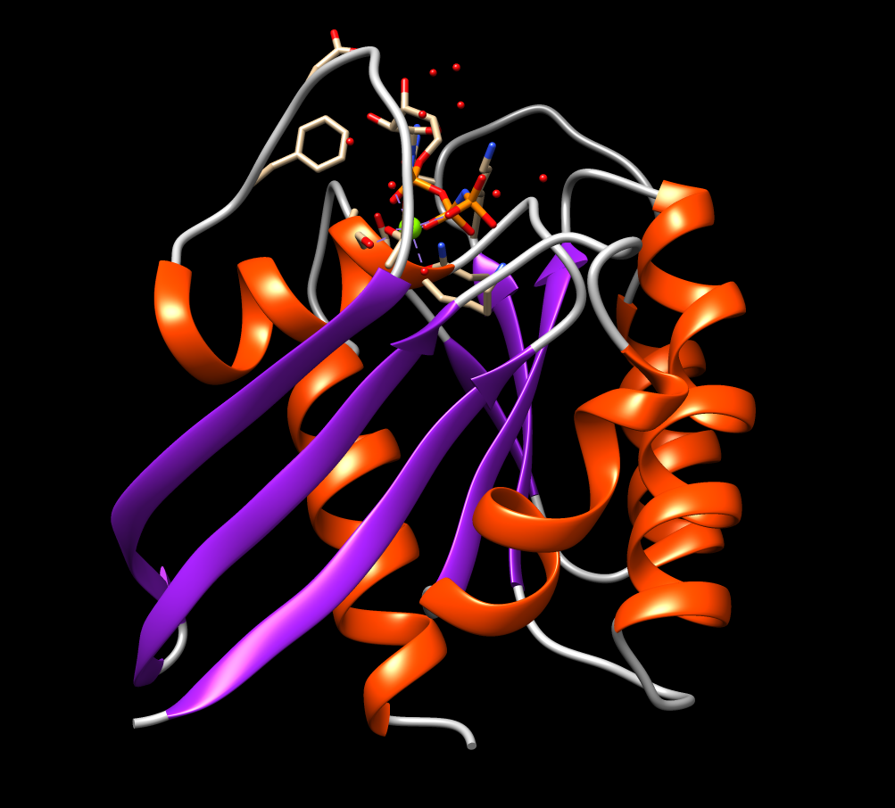
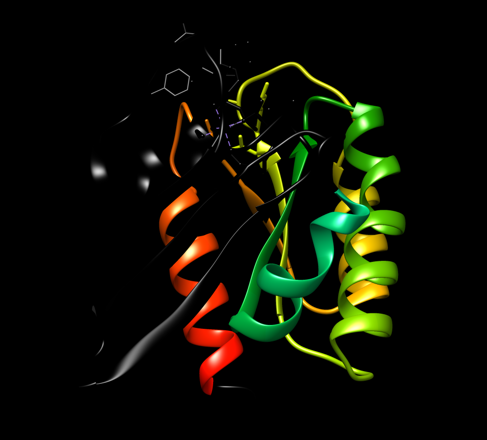
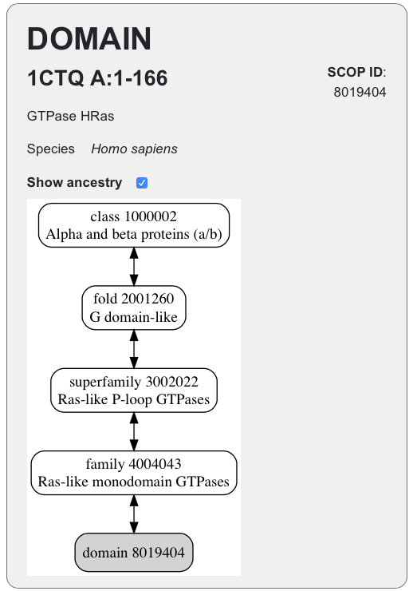

 <head>
    <meta charset="utf-8">
    <title>{{ page.title }}</title>
<script src="https://cdn.jsdelivr.net/npm/babel-polyfill/dist/polyfill.min.js"></script>
    <!-- Web component polyfill (only loads what it needs) -->
<script src="https://cdn.jsdelivr.net/npm/@webcomponents/webcomponentsjs/webcomponents-lite.js" charset="utf-8"></script>
    <!-- Required to polyfill modern browsers as code is ES5 for IE... -->
<script src="https://cdn.jsdelivr.net/npm/@webcomponents/webcomponentsjs/custom-elements-es5-adapter.js" charset="utf-8"></script>

<link rel="stylesheet" type="text/css" href="https://www.ebi.ac.uk/pdbe/pdb-component-library/css/pdbe-molstar-1.2.1.css">
<script type="text/javascript" src="https://www.ebi.ac.uk/pdbe/pdb-component-library/js/pdbe-molstar-component-1.2.1.js"></script>
<style>
        #myViewer{
          float:none;
          width:400px;
          height:400px;
          position:relative;
        }
    </style>
  </head>

<h1> Anàlisi de les relacions seqüència-estructura-funció del receptor B2-adrenèrgic (PDB: 2RH1)</h1>

- [Estructura secundària](#estructura-secundària)
- [Estructura supersecundària](#estructura-supersecundària)
- [Plegament](#plegament)
- [Funció](#funció)


 El codi [PDB:2RH1](https://www.rcsb.org/structure/2rh1) correspon a l'estructura del receptor acoblat a proteïna G B2-adrenèrgic, gen ADRB2, codi [UNIPROT:P07550](https://www.uniprot.org/uniprot/P07550). Per veure la conservació de seqüència podem anar a la fitxa que ENSEMBL ofereix per a la comparació dels diversos ortòlegs del gen ADRB2 ([ENSG00000169252](http://www.ensembl.org/Homo_sapiens/Gene/Compara_Ortholog?db=core;g=ENSG00000169252;r=5:148826611-148828623;t=ENST00000305988)). Podem comprovar que entre els ortòlegs existents a la base de dades hi ha una gran conservació de seqüència d'aminoàcids respecte la seqüència humana, amb un mínim del 80% amb ortòlegs en mamífers, un minim del 46% amb sauròpodes (rèptils i ocells) i un mínim del 36% amb peixos.

La seqüència de la proteïna al PDB és

```fasta
>2RH1_1|Chain A|beta-2-adrenergic receptor/T4-lysozyme chimera|Homo sapiens (9606)
DYKDDDAMGQPGNGSAFLLAPNRSHAPDHDVTQQRDEVWVVGMGIVMSLIVLAIVFGNVLVITAIAKFERLQTVTNYFITSLACADLVMGLAVVPFGAAHILMKMWTFGNFWCEFWTSIDVLCVTASIETLCVIAVDRYFAITSPFKYQSLLTKNKARVIILMVWIVSGLTSFLPIQMHWYRATHQEAINCYAEETCCDFFTNQAYAIASSIVSFYVPLVIMVFVYSRVFQEAKRQLNIFEMLRIDEGLRLKIYKDTEGYYTIGIGHLLTKSPSLNAAKSELDKAIGRNTNGVITKDEAEKLFNQDVDAAVRGILRNAKLKPVYDSLDAVRRAALINMVFQMGETGVAGFTNSLRMLQQKRWDEAAVNLAKSRWYNQTPNRAKRVITTFRTGTWDAYKFCLKEHKALKTLGIIMGTFTLCWLPFFIVNIVHVIQDNLIRKEVYILLNWIGYVNSGFNPLIYCRSPDFRIAFQELLCLRRSSLKAYGNGYSSNGNTGEQSG
```

i es pot veure a a l'[alineament](https://www.rcsb.org/uniprot/P07550) que el propi PDB dona que hi ha una bona cobertura de la seqüència global de la proteïna

Pots visualitzar la proteïna en aquesta finestra proveïda per [Mol*](https://molstar.org):

<p>
<div id="myViewer">
<pdbe-molstar id="pdbeMolstarComponent" molecule-id="2rh1" hide-controls="true"></pdbe-molstar>
</div>
</p>
<br>  

## Estructura secundària

L'estructura presenta tant hèlix alfa com fulles beta

||
|:--:|
|Imatge de la proteïna mostrant els elements d'estructura secundària.|

La següent figura mostra la seqüència de la proteïna i les regions amb hèlix alfa (groc) i fulles beta (verd)

||
|:--:|
|Seqüència de la proteïna mostrant els elements d'estructura secundària|

## Estructura supersecundària

La figura mostra l'estructura amb un codi de colors progressiu que permet identificar la regió N-terminal (blau) i la regió C-terminal (vermell).

||
|:--:|
|Imatge de la proteïna amb la representació amb colors de fred (blau) a calent (vermell) en funció de la seqüència.|

Malauradament el fitxer PBD no conté massa informació sbre l'estructura secundària i no en podem treure massa profit, en aquest cas. Anem a [visualitzar la proteïna a Chimera](../code/5p21.py). Podem observar diversos motius d'estructura supersecundària, que es poden deduir també de l'observació de la seqüència a la figura de més amunt.

| motiu | regio | imatge |
|:-------:|:-------:|:--------:|
|   $\beta$-hairpin    |   ```EDSYRKQVVIDGETCLLDILDT```    |        |
|    P-loop   |    ```MTEYKLVVVGAGGVGKSALTIQLIQN```   |           |
|     motius $\beta-\alpha-\beta$ amb la fulla $\beta$ tancada    |    ```SAMRDQYMRTGEGFLCVFAINNTKSFED```<br>```IHQYREQIKRVKDSDDVPMVLVGNKCDL```<br>```AARTVESRQAQDLARSYGIPYIETSAKT```<br>```RQGVEDAFYTLVREIR``` |           |

## Plegament

Es tracta d'una proteïna $\alpha/\beta$, amb un plegament de tipus *G-domain-like* quin representant és PDB:1CTQ [segons la clasificació a SCOP](https://scop.mrc-lmb.cam.ac.uk/term/8019404)

||
|:--:|
|Estructura jeràrquica del domini al qual pertany PDB:5P21, representada a SCOP per PDB:1CTQ|

i de domini que forma part de la superfamília *P-loop containing nucleotide triosephosphate hydrolases* [segons CATH](http://www.cathdb.info/search?q=5p21).

## Funció

Podem començar per [cercar a PFAM el codi uniprot de la proteïna](http://pfam.xfam.org/protein/P01112). Veiem que es tracta d'una proteïna amb un sol domini ben caracteritzat:

||
|:--:|
|Taula resum dels dominis PFAM per al PDB:5p21, UNIPROT: P01112|

Podem aleshores explorar l'entrada per a aquest domini específic: PFAM: PF00071, i observem que es tracta d'una GTPasa. El domini concret Ras està altament distribuït, trobat en més de [1500 arquitectures diferents](http://pfam.xfam.org/family/PF00071#tabview=tab1), vora [2000 espècies](http://pfam.xfam.org/family/PF00071#tabview=tab7)

L'estudi del [logo HMM](http://pfam.xfam.org/family/ras#tabview=tab4) ens mostra una regió molt enriquida en glicines corresponent al P-loop, i també la gran conservació de la Treonina 35 del fitxer PDB (posició 31 en el logo HMM), que és essencial per a la coordinació de l'ió magnesi, que participa en la reacció GTPasa, com es pot apreciar en el centre actiu de la proteïna:

||
|:--:|
|Centre actiu de la proteïna PDB:5p21. S'aprecia que l'ió magnesi està coordinat per 6 àtoms d'oxigen: dos provinents de sengles molècules d'aigua, dos dels fosfats $\beta$ i $\gamma$ del GTP, un de la serina 17 i un altre de la treonina 35 (aquests dos residus, altament conservats en les posicions [13 i 31 del logo HMM](http://pfam.xfam.org/family/ras#tabview=tab4)).|

Altres residus altament conservats que s'aprecien al logo PFAM tenen tasques estructures importants en l'activitat de la proteïna Ras.
