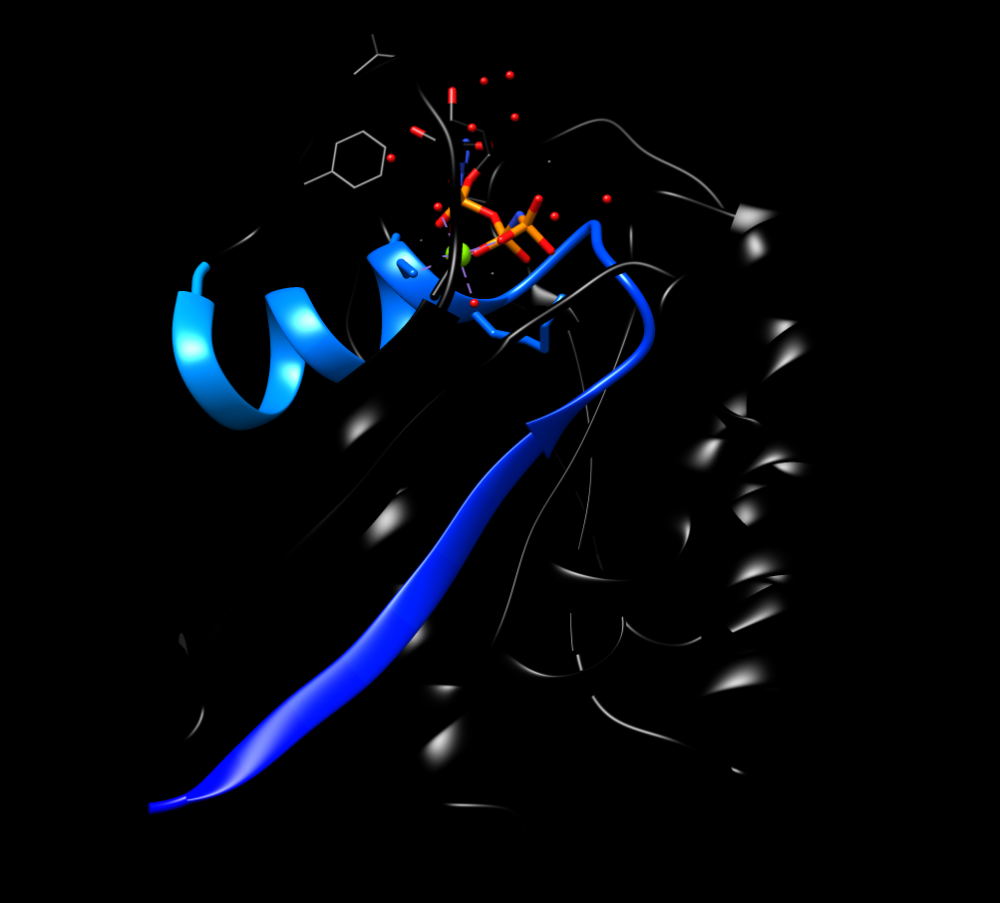
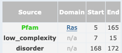

# Anàlisi de les relacions seqüència-estrcutura-funció de la proteïna H-RAS p21 (PDB: 5P21)


- [Anàlisi de les relacions seqüència-estrcutura-funció de la proteïna H-RAS p21 (PDB: 5P21)](#anàlisi-de-les-relacions-seqüència-estrcutura-funció-de-la-proteïna-h-ras-p21-pdb-5p21)
  - [Estructura secundària](#estructura-secundària)
  - [Estructura supersecundària](#estructura-supersecundària)
  - [Plegament](#plegament)
  - [Funció](#funció)

 El codi [PDB:5P21](https://www.rcsb.org/structure/5p21) correspon a l'estructura de la proteïna H-RAS p21,codi [UNIPROT:P01112](https://www.uniprot.org/uniprot/P01112), amb una gran conservació de seqüència pel que es pot veure a l'[alineament](https://www.rcsb.org/uniprot/P01112) que el propi PDB ens dona.


La seqüència de la proteïna al PDB és

```fasta
>5P21
MTEYKLVVVGAGGVGKSALTIQLIQNHFVDEYDPTIEDSYRKQVVIDGETCLLDILDTAGQEEYSAMRDQYMRTGEGFLCVFAINNTKSFEDIHQYREQIKRVKDSDDVPMVLVGNKCDLAARTVESRQAQDLARSYGIPYIETSAKTRQGVEDAFYTLVREIRQH
```

## Estructura secundària 

L'estructura presenta tant hèlix alfa com fulles beta


La següent figura mostra la seqüència de la proteïna i les regions amb hèlix alfa (groc) i fulles beta (verd)


## Estructura supersecundària 

La figura mostra l'estructura amb un codi de colors progressiu que permet identificar la regió N-terminal (blau) i la regió C-terminal (vermell). 


Malauradament el fitxer PBD no conté massa informació sbre l'estructura secundària i no en podem treure massa profit, en aquest cas. Anem a [visualitzar la proteïna a Chimera](../code/5p21.py). Podem observar diversos motius d'estructura supersecundària, que es poden deduir també de l'observació de la seqüència a la figura de més amunt.

| motiu | regio | imatge |
|:-------:|:-------:|:--------:|
|   $\beta$-hairpin    |   ```EDSYRKQVVIDGETCLLDILDT```    |        |
|    P-loop   |    ```MTEYKLVVVGAGGVGKSALTIQLIQN```   |           |
|     motius $\beta-\alpha-\beta$ amb la fulla $\beta$ tancada    |    ```SAMRDQYMRTGEGFLCVFAINNTKSFED```<br>```IHQYREQIKRVKDSDDVPMVLVGNKCDL```<br>```AARTVESRQAQDLARSYGIPYIETSAKT```<br>```RQGVEDAFYTLVREIR``` |           |

## Plegament 

Es tracta d'una proteïna $\alpha/\beta$, amb un plegament de tipus *G-domain-like* quin representant és PDB:1CTQ [segons la clasificació a SCOP](https://scop.mrc-lmb.cam.ac.uk/term/8019404) 


i de domini que forma part de la superfamília *P-loop containing nucleotide triosephosphate hydrolases* [segons CATH](http://www.cathdb.info/search?q=5p21).

## Funció

Podem començar per [cercar a PFAM el codi uniprot de la proteïna](http://pfam.xfam.org/protein/P01112). Veiem que es tracta d'una proteïna amb un sol domini ben caracteritzat: 

. 

Podem aleshores explorar l'entrada per a aquest domini específic: PFAM: PF00071, i observem que es tracta d'una GTPasa. El domini concret Ras està altament distribuït, trobat en més de [1500 arquitectures diferents](http://pfam.xfam.org/family/PF00071#tabview=tab1), vora [2000 espècies](http://pfam.xfam.org/family/PF00071#tabview=tab7)


L'estudi del [logo HMM](http://pfam.xfam.org/family/ras#tabview=tab4) ens mostra una regió molt enriquida en glicines corresponent al P-loop, i també la gran conservació de la Treonina 35 del fitxer PDB (posició 31 en el logo HMM), que és essencial per a la coordinació de l'ió magnesi, que participa en la reacció GTPasa, com es pot apreciar en el centre actiu de la proteïna:


).](../figures/5p21_centreactiu.png)

Altres residus altament conservats que s'aprecien al logo PFAM tenen tasques estructures importants en l'activitat de la proteïna Ras.