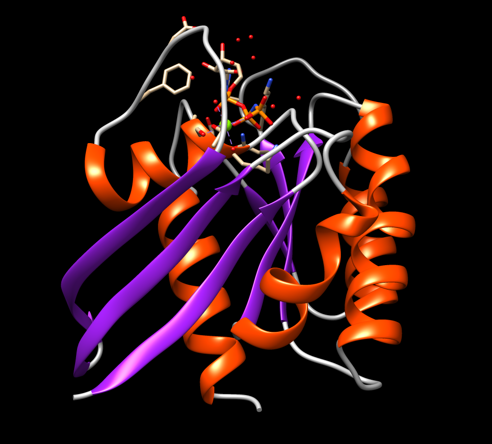
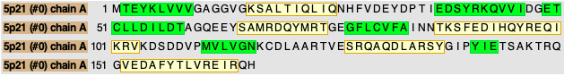
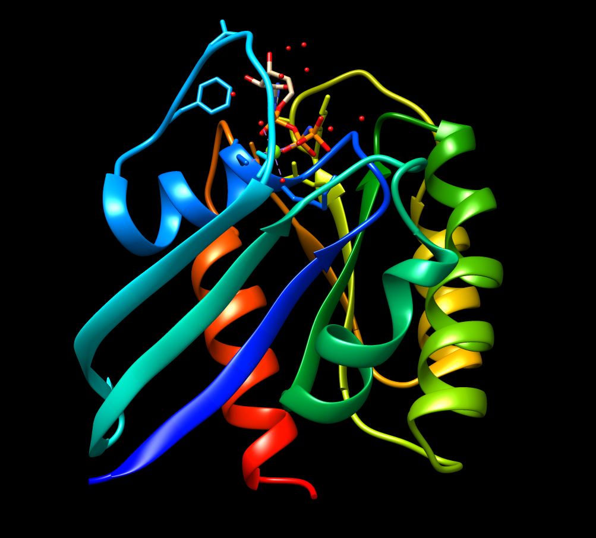
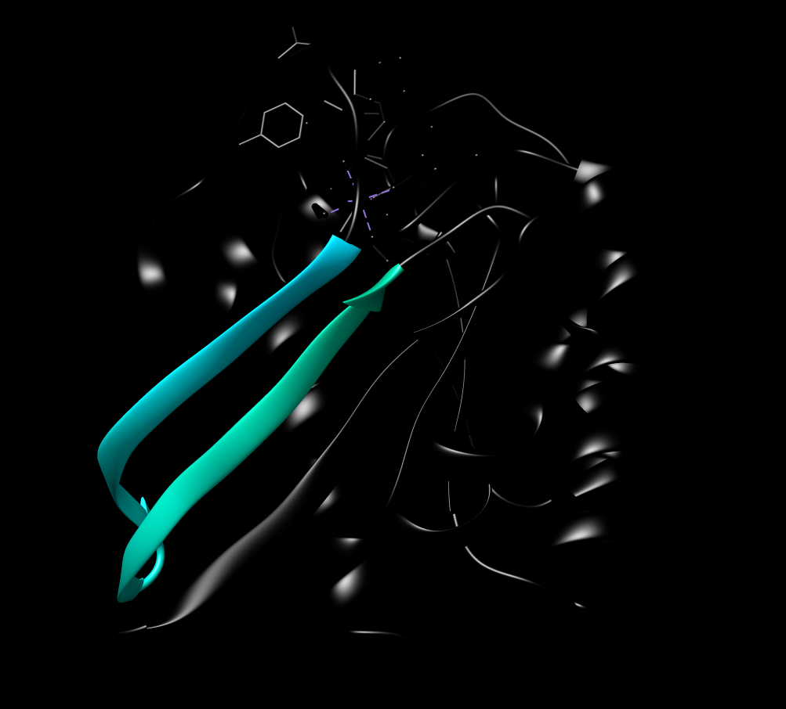
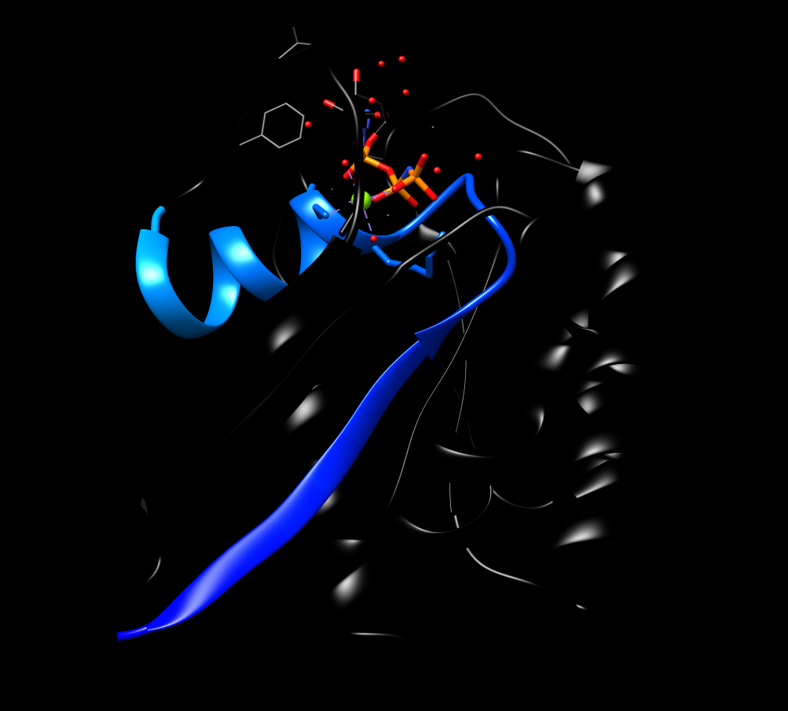
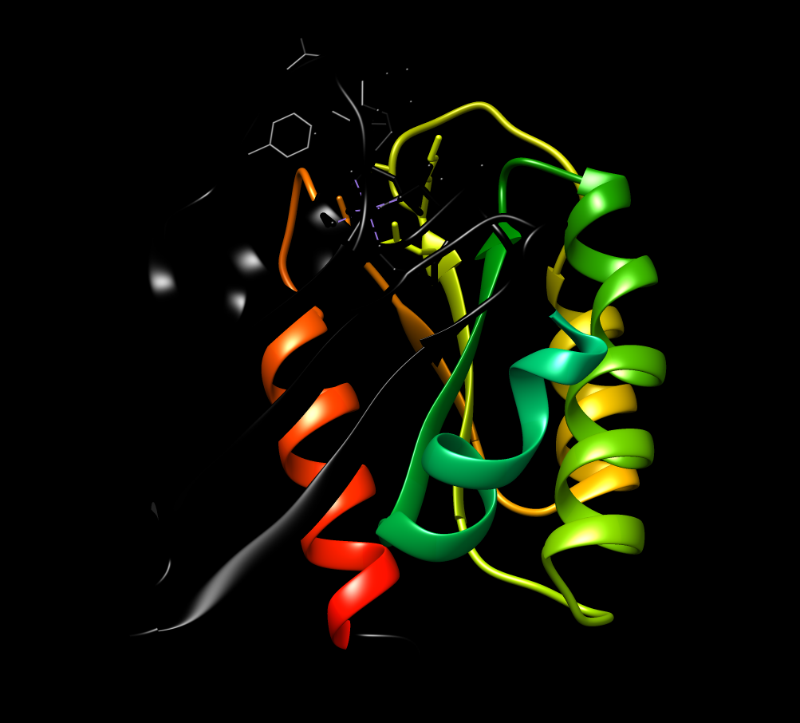

- [Exemples d'anàlisi d'estructures](#exemples-danàlisi-destructures)
  - [PDB: 5P21](#pdb-5p21)
    - [Estructura secundària](#estructura-secundària)
    - [Estructura supersecundària](#estructura-supersecundària)
    - [Plegament](#plegament)
    - [Funció](#funció)
  - [PDB: 1PRN](#pdb-1prn)
    - [Estructura secundària](#estructura-secundària-1)
    - [Estructura supersecundària](#estructura-supersecundària-1)
    - [Plegament](#plegament-1)
    - [Funció](#funció-1)
  - [PDB: 1BL8](#pdb-1bl8)
    - [Estructura secundària](#estructura-secundària-2)
    - [Estructura supersecundària](#estructura-supersecundària-2)
    - [Plegament](#plegament-2)
    - [Funció](#funció-2)
  - [PDB: 2RH1](#pdb-2rh1)
    - [Estructura secundària](#estructura-secundària-3)
    - [Estructura supersecundària](#estructura-supersecundària-3)
    - [Plegament](#plegament-3)
    - [Funció](#funció-3)
  - [PDB: 1BIF](#pdb-1bif)
    - [Estructura secundària](#estructura-secundària-4)
    - [Estructura supersecundària](#estructura-supersecundària-4)
    - [Plegament](#plegament-4)
    - [Funció](#funció-4)
  - [PDB: 3H8Q](#pdb-3h8q)
    - [Estructura secundària](#estructura-secundària-5)
    - [Estructura supersecundària](#estructura-supersecundària-5)
    - [Plegament](#plegament-5)
    - [Funció](#funció-5)


# Exemples d'anàlisi d'estructures
 
## PDB: 5P21

 El codi [PDB:5P21](https://www.rcsb.org/structure/5p21) correspon a l'estructura de la proteïna H-RAS p21,codi [UNIPROT:P01112](https://www.uniprot.org/uniprot/P01112), amb una gran conservació de seqüència pel que es pot veure a l'[alineament](https://www.rcsb.org/uniprot/P01112) que el propi PDB ens dona.

 * [Sessió a Chimera](../code/5p21.py)


La seqüència de la proteïna al PDB és

```fasta
>5P21
MTEYKLVVVGAGGVGKSALTIQLIQNHFVDEYDPTIEDSYRKQVVIDGETCLLDILDTAGQEEYSAMRDQYMRTGEGFLCVFAINNTKSFEDIHQYREQIKRVKDSDDVPMVLVGNKCDLAARTVESRQAQDLARSYGIPYIETSAKTRQGVEDAFYTLVREIRQH
```

### Estructura secundària 

L'estructura presenta tant hèlix alfa com fulles beta



La següent figura mostra la seqüència de la proteïna i les regions amb hèlix alfa (groc) i fulles beta (verd)



### Estructura supersecundària 

La figura mostra l'estructura amb un codi de colors que permet identificar la regió N-terminal (blau) i la regió C-terminal (vermell). 



Malauradament el fitxer PBD no conté massa informació sbre l'estructura secundària i no en podem treure massa profit, en aquest cas. Anem a visualitzar la proteïna a chimera. Podem observar diversos motius d'estructura supersecundària, que es poden deduir també de l'observació de la seqüència a la figura de més amunt.

| motiu | regio | imatge |
|:-------:|:-------:|:--------:|
|   $\beta$-hairpin    |   ```EDSYRKQVVIDGETCLLDILDT```    |        |
|    P-loop   |    ```MTEYKLVVVGAGGVGKSALTIQLIQN```   |           |
|     motius $\beta-\alpha-\beta$ amb la fulla $\beta$ tancada    |    ```SAMRDQYMRTGEGFLCVFAINNTKSFED```<br>```IHQYREQIKRVKDSDDVPMVLVGNKCDL```<br>```AARTVESRQAQDLARSYGIPYIETSAKT```<br>```RQGVEDAFYTLVREIR``` |           |


### Plegament 

Es tracta d'una proteïna $\alpha/\beta$, amb un plegament de tipus *G-domain-like* quin representant és PDB:1CTQ [segons la clasificació a SCOP](https://scop.mrc-lmb.cam.ac.uk/term/8019404) 


i de domini que forma part de la superfamília *P-loop containing nucleotide triosephosphate hydrolases* [segons CATH](http://www.cathdb.info/search?q=5p21).

### Funció

## PDB: 1PRN


### Estructura secundària 
### Estructura supersecundària 
### Plegament 
### Funció


## PDB: 1BL8


### Estructura secundària 
### Estructura supersecundària 
### Plegament 
### Funció


## PDB: 2RH1


### Estructura secundària 
### Estructura supersecundària 
### Plegament 
### Funció

## PDB: 1BIF


### Estructura secundària 
### Estructura supersecundària 
### Plegament 
### Funció

## PDB: 3H8Q


### Estructura secundària 
### Estructura supersecundària 
### Plegament 
### Funció
