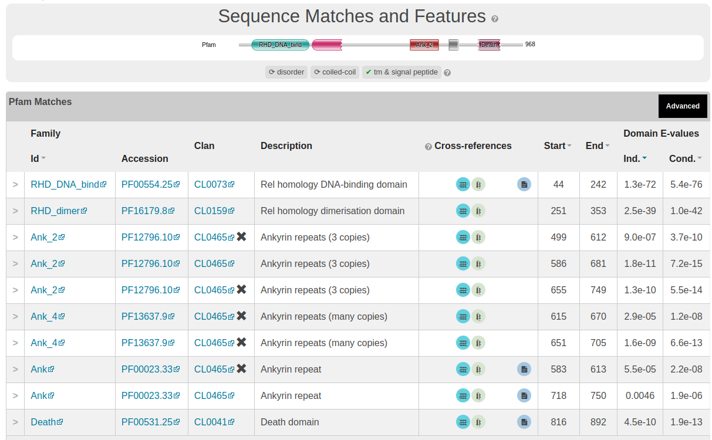
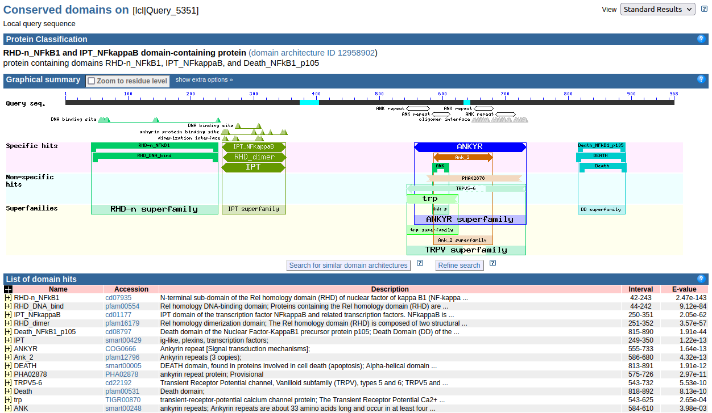
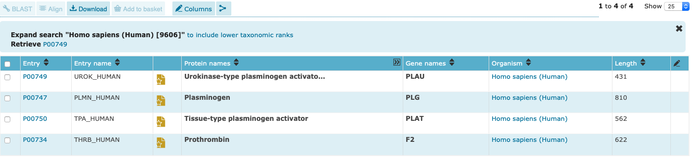
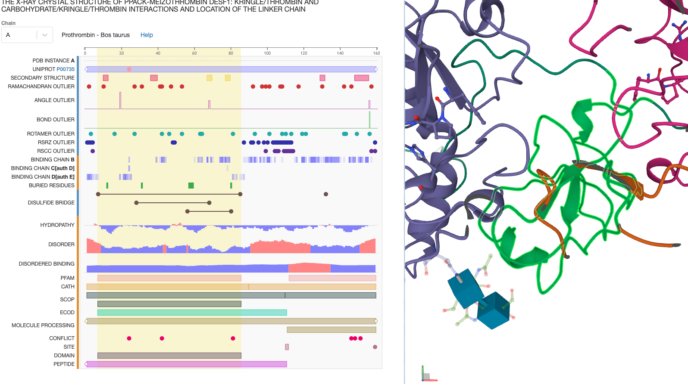
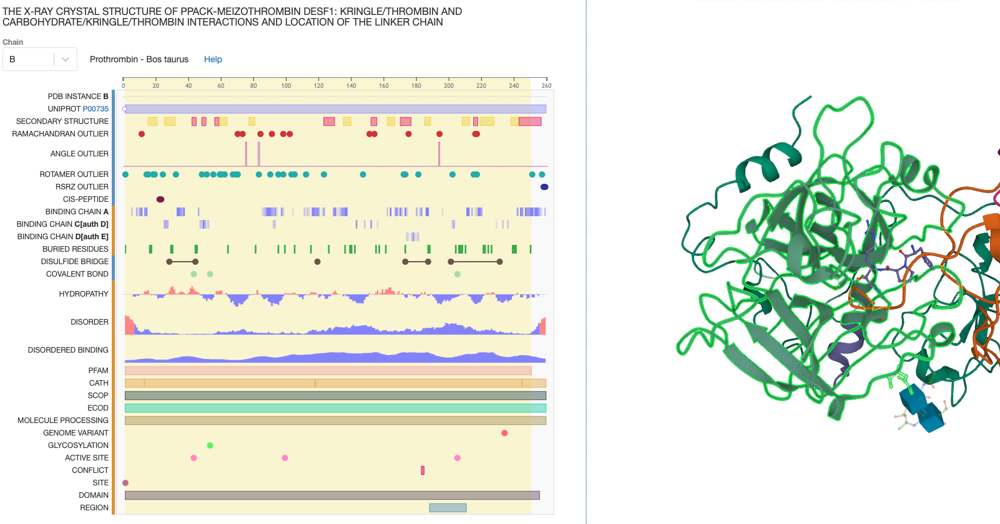

 <head>
    <meta charset="utf-8">
    <title>{{ page.title }}</title>
<script src="https://cdn.jsdelivr.net/npm/babel-polyfill/dist/polyfill.min.js"></script>
    <!-- Web component polyfill (only loads what it needs) -->
<script src="https://cdn.jsdelivr.net/npm/@webcomponents/webcomponentsjs/webcomponents-lite.js" charset="utf-8"></script>
    <!-- Required to polyfill modern browsers as code is ES5 for IE... -->
<script src="https://cdn.jsdelivr.net/npm/@webcomponents/webcomponentsjs/custom-elements-es5-adapter.js" charset="utf-8"></script>

<link rel="stylesheet" type="text/css" href="https://www.ebi.ac.uk/pdbe/pdb-component-library/css/pdbe-molstar-1.2.1.css">
<script type="text/javascript" src="https://www.ebi.ac.uk/pdbe/pdb-component-library/js/pdbe-molstar-component-1.2.1.js"></script>
<style>
        #myViewer{
          float:none;
          width:400px;
          height:400px;
          position:relative;
        }
    </style>
  </head>

# Exercicis relacions seqüència-estructura-funció


## Preparació

1. Instal·lació de [Jalview](http://www.jalview.org/getdown/release/#)
2. Familiarització amb **[Pfam](https://pfam.xfam.org/)**
3. [Tutorial](./TutorialPFAM.pdf) de PFAM

## EXERCICI 1) Exploració dels dominis d'una proteïna

### Qüestió

Considereu la següent proteina. Fent servir informació dels dominis presents indiqueu de quin tipus de proteïna es tracta. Raoneu la vostra resposta: Indiqueu quins dominis presenta, a quines posicions, quines funcions porten associades, a quin clan PFAM, etc. Il·lustreu la vostra resposta amb alineaments trobats a PFAM, amb estructures del PDB, etc.

```
>protein x
MAEDDPYLGRPEQMFHLDPSLTHTIFNPEVFQPQMALPTDGPYLQILEQPKQRGFRFRYV
CEGPSHGGLPGASSEKNKKSYPQVKICNYVGPAKVIVQLVTNGKNIHLHAHSLVGKHCED
GICTVTAGPKDMVVGFANLGILHVTKKKVFETLEARMTEACIRGYNPGLLVHPDLAYLQA
EGGGDRQLGDREKELIRQAALQQTKEMDLSVVRLMFTAFLPDSTGSFTRRLEPVVSDAIY
DSKAPNASNLKIVRMDRTAGCVTGGEEIYLLCDKVQKDDIQIRFYEEEENGGVWEGFGDF
SPTDVHRQFAIVFKTPKYKDINITKPASVFVQLRRKSDLETSEPKPFLYYPEIKDKEEVQ
RKRQKLMPNFSDSFGGGSGAGAGGGGMFGSGGGGGGTGSTGPGYSFPHYGFPTYGGITFH
PGTTKSNAGMKHGTMDTESKKDPEGCDKSDDKNTVNLFGKVIETTEQDQEPSEATVGNGE
VTLTYATGTKEESAGVQDNLFLEKAMQLAKRHANALFDYAVTGDVKMLLAVQRHLTAVQD
ENGDSVLHLAIIHLHSQLVRDLLEVTSGLISDDIINMRNDLYQTPLHLAVITKQEDVVED
LLRAGADLSLLDRLGNSVLHLAAKEGHDKVLSILLKHKKAALLLDHPNGDGLNAIHLAMM
SNSLPCLLLLVAAGADVNAQEQKSGRTALHLAVEHDNISLAGCLLLEGDAHVDSTTYDGT
TPLHIAAGRGSTRLAALLKAAGADPLVENFEPLYDLDDSWENAGEDEGVVPGTTPLDMAT
SWQVFDILNGKPYEPEFTSDDLLAQGDMKQLAEDVKLQLYKLLEIPDPDKNWATLAQKLG
LGILNNAFRLSPAPSKTLMDNYEVSGGTVRELVEALRQMGYTEAIEVIQAASSPVKTTSQ
AHSLPLSPASTRQQIDELRDSDSVCDSGVETSFRKLSFTESLTSGASLLTLNKMPHDYGQ
EGPLEGKI
```

NOTA: A part del `sequence search` link a la web de PFAM també pots utilitzar el servidor [HMMER](https://www.ebi.ac.uk/Tools/hmmer/search/hmmscan) de l'EBI, més ràpid. Selecciona la base de dades PFAM per fer la cerca).

### Resposta

Usant la web de l'EBI, i fent una cerca de la seqüència, obtenim la imatge següent:



La taula mostra 4 clars dominis:

* [Rel homology DNA-binding domain](http://pfam.xfam.org/family/RHD_DNA_bind) 	
* [Rel homology dimerisation domain](http://pfam.xfam.org/family/RHD_dimer) 	
* Ankyrin repeats (diverses còpies i variants: [ANK](http://pfam.xfam.org/family/Ank), [ANK_2](http://pfam.xfam.org/family/Ank_2) i [ANK_4](http://pfam.xfam.org/family/Ank_4)) 	
* [Death domain](http://pfam.xfam.org/family/Death)

Com expliquem al [Tutorial](/tutorialPFAM) de PFAM, observem famílies PFAM (dominis RHD_DNA_bind,  RHD_dimer i DEATH), així com dominis repetits (Ankyrin, en aquest cas).

La informació a les pàgines de PFAM ens mostra que:  

* el domini RHD_DNA_bind és típic de factors de transcripció, entre els quals la proteïna NF-KB;
* el domini RHD_Dimer ajuda a la dimerització del domini RHD_DNA_bind, que té sempre en N-terminal;
* el domini DEATH està composat de 6 hèlix alfa;
* finalment, els repeats Ankyrin
  
Una cerca amb BLAST a NCBI ens mostra que, certament,  es tracta de la proteïna NF-KB, i entrant amb més detall als resultats del BLAST obtenim informació sobre els dominis des del propi NCBI.



Finalment, és molt interessant usar el portal [InterPro](https://www.ebi.ac.uk/interpro/) de l'EBI. Allà, amb una sola cerca per seqüència, podem accedir a informació sobre les diferents regions de la seqüència en una gran varietat de bases de dades i servidors. [Aquí disposeu d'un fitxer PDF](figures/InterProScan.pdf) amb el resultat de la cerca de la nostra seqüència problema, confirmant que es tracta de la subunitat p105 del factor nuclear NF$\kappa$B, i podem accedir a les diverses bases de dades que descriuen els dominis de la proteïna (`RHD_DNA_bind` en vermell , `RHD_Dimer` en blau, `ANK` en verd i `DEATH` en  groc): 

<pre>
>protein x
MAEDDPYLGRPEQMFHLDPSLTHTIFNPEVFQPQMALP<span class="inner-pre" style="color: red">TDGPYLQILEQPKQRGFRFRYV
CEGPSHGGLPGASSEKNKKSYPQVKICNYVGPAKVIVQLVTNGKNIHLHAHSLVGKHCED
GICTVTAGPKDMVVGFANLGILHVTKKKVFETLEARMTEACIRGYNPGLLVHPDLAYLQA
EGGGDRQLGDREKELIRQAALQQTKEMDLSVVRLMFTAFLPDSTGSFTRRLEPVVSDAIY
DSKAPNA</span><span class="inner-pre" style="color: blue">SNLKIVRMDRTAGCVTGGEEIYLLCDKVQKDDIQIRFYEEEENGGVWEGFGDF
SPTDVHRQFAIVFKTPKYKDINITKPASVFVQLRRKSDLETSEPKPFLYYP</span>EIKDKEEVQ
RKRQKLMPNFSDSFGGGSGAGAGGGGMFGSGGGGGGTGSTGPGYSFPHYGFPTYGGITFH
PGTTKSNAGMKHGTMDTESKKDPEGCDKSDDKNTVNLFGKVIETTEQDQEPSEATVGNGE
VTLTYATGTKEESAGVQDNLFLEKAMQLAKRHANALFDYAVTGDVKMLLAVQRH<span class="inner-pre" style="color: green">LTAVQD
ENGDSVLHLAIIHLHSQLVRDLLEVTSGLISDDIINMRNDLYQTPLHLAVITKQEDVVED
LLRAGADLSLLDRLGNSVLHLAAKEGHDKVLSILLKHKKAALLLDHPNGDGLNAIHLAMM
SNSLPCLLLLVAAGADVNAQEQKSGRTALHLAVEHDNISLAGCLLLEGDAHVDSTTYDGT
TPLHIAAGRGSTRLAALLKAAGADPLVENFEPLYDLDDSWENAGEDEGVVPGTTPLDMAT
SWQVFDILNGKPY</span>EPEFTSDDLLA<span class="inner-pre" style="color: yellow">QGDMKQLAEDVKLQLYKLLEIPDPDKNWATLAQKLG
LGILNNAFRLSPAPSKTLMDNYEVSGGTVRELVEALRQMGYTEAIEVIQAAS</span>SPVKTTSQ
AHSLPLSPASTRQQIDELRDSDSVCDSGVETSFRKLSFTESLTSGASLLTLNKMPHDYGQ
EGPLEGKI
</pre>

## EXERCICI 2) Dominis compartits

### Qüestió

Considereu les proteïnes amb codis UNIPROT: P00749, P00734, P00750 i P00747. Quins tipus de dominis presenten aquestes proteïnes? Presenten algun tipus de dominis comuns? Podeu especular quelcom sobre la seva relació funcional basant-vos en la composició de dominis i la seva conservació? PISTA: Formen part de la [cascada de coagulació](https://www.osmosis.org/answers/coagulation-cascade).

### Resposta

Comencem per accedir a Uniprot i explorar cadascun d'aquests codis. 




Els dominis trobats a PFAM són:

| uniprot | nom | dominis |
|---------|-----|---------|
| [P00749](https://www.uniprot.org/uniprot/P00749)  | UROK_HUMAN | [Kringle](https://pfam.xfam.org/family/PF00051), [Trypsin](https://pfam.xfam.org/family/PF00089) |
| [P00734](https://www.uniprot.org/uniprot/P00734)  | THRB_HUMAN | [Gla](https://pfam.xfam.org/family/PF00594), [Kringle](https://pfam.xfam.org/family/PF00051), [Thrombin_light](https://pfam.xfam.org/family/PF09396), [Trypsin](https://pfam.xfam.org/family/PF00089) |
| [P00750](https://www.uniprot.org/uniprot/P00750)  | TPA_HUMAN | [EGF](https://pfam.xfam.org/family/PF00008), [fn1](https://pfam.xfam.org/family/PF00039), [Kringle](https://pfam.xfam.org/family/PF00051), [Trypsin](https://pfam.xfam.org/family/PF00089) |
| [P00747](https://www.uniprot.org/uniprot/P00747)  | PLMN_HUMAN | [Kringle](https://pfam.xfam.org/family/PF00051), [PAN_1](https://pfam.xfam.org/family/PF00024), [Trypsin](https://pfam.xfam.org/family/PF00089) |

Observem que hi ha dos dominis comuns:

* Els kringles són dominis estructurals autònoms que es troben a la coagulació de la sang i les proteïnes fibrinolítiques. Tenen un paper rellevant en la regulació de l'activitat proteolítica [(PUBMED:[3886654](https://pubmed.ncbi.nlm.nih.gov/3886654/)) (PUBMED:[6373375](https://pubmed.ncbi.nlm.nih.gov/6373375/)) (PUBMED:[2157850](https://pubmed.ncbi.nlm.nih.gov/2157850/))]. Els dominis Kringle [ (PUBMED:[3131537](https://pubmed.ncbi.nlm.nih.gov/3131537/)) (PUBMED:[3891096](https://pubmed.ncbi.nlm.nih.gov/3891096/)) (PUBMED:[1879523](https://pubmed.ncbi.nlm.nih.gov/1879523/))] es caracteritzen per una estructura de triple bucle, incloent 3 ponts disulfur, la conformació del qual està definida per una sèrie d'enllaços d'hidrogen i petites peces de fulles beta antiparal·leles. Es troben en un nombre variable de còpies en algunes proteïnes plasmàtiques, incloent les quatre de la cascada que ens demanen en aquesta pregunta. La imatge mostra el domini Kringle (en verd) en l'estructura de la protrombina de la vaca (PDB: [1A0H](https://www.rcsb.org/3d-sequence/1A0H?assemblyId=1)):



* Les proteïnes de la familia de la tripsina són proteases de serina. És a dir, presenta una tríada catalítica ASP-HIS-SER en el centre actiu. La imatge mostra el domini tripsina (en verd) en la mateixa estructura (PDB: [1A0H](https://www.rcsb.org/3d-sequence/1A0H?assemblyId=1)):



El fet de disposar de dominis d'interacció entre proteases (kringle) i de les pròpies proteases (domini tripsina) mostra clarament un seguit de proteïnes que treballen en cascada, amb interaccions entre elles i les proteïnes a catalitzar.

## EXERCICI 3) Homologia

### Qüestió

Considereu aquestes 3 proteïnes (codi Uniprot entre parèntesis): 

* Lin-49 (Q20318) de C. Elegans
* Peregrin (P55201) de H. Sapiens
* YOR031W (Q12311) de S. cerevisiae

Primer, definiu quin podria ser l'ancestre comú d'aquestes tres proteïnes, tenint en compte la seva composició de dominis. Justifiqueu la vostra resposta. Un cop definit l'ancestre comú, hipotetitzeu sobre el possible camí evolutiu d’aquestes tres proteïnes. Justifiqueu la vostra resposta.

### Resposta

Aquest cop treballarem amb Interpro enlloc de PFAM, ja que ens ofereix un major ventall d'interrelacions, però la discussió és anàloga.

| uniprot | nom | dominis |
|---------|-----|---------|
| [Q20318](https://www.uniprot.org/uniprot/Q20318)  | LIN49_CAEEL, Lin-49 | [Bromodomain](https://www.ebi.ac.uk/interpro/entry/IPR001487), [EPHD](https://www.ebi.ac.uk/interpro/entry/IPR034732), [Znf_PHD](https://www.ebi.ac.uk/interpro/entry/IPR001965)  |
| [P55201](https://www.uniprot.org/uniprot/P55201)  | BRPF1_HUMAN, Peregrin | [EPL1](P55201),  [EPHD](https://www.ebi.ac.uk/interpro/entry/IPR034732),  [Znf_PHD](https://www.ebi.ac.uk/interpro/entry/IPR001965), [Bromodomain](https://www.ebi.ac.uk/interpro/entry/IPR001487) |
| [Q12311](https://www.uniprot.org/uniprot/Q12311)  | NTO1_YEAST, NuA3 | [EPL1](P55201),  [EPHD](https://www.ebi.ac.uk/interpro/entry/IPR034732),  [Znf_PHD](https://www.ebi.ac.uk/interpro/entry/IPR001965) |

Començariem per aquella proteïna que presentés els dominis comuns a tots: PH i ZF. A partir d’aquí hauriem de pensar en diferents posibilitats per anar incorporant la resta: EPL1 i Bromodomain. És important veure que el EPL1 es comú a Peregrin i YOR031W però no esta present a Lin-49, per tant la primera especiació implica que una de les branques incorpora EPL1, però l’altra no. A partir d’aquestes dues branques, la que ha incorporat EPL1, es tornaria a bifurcar amb una proteina que ja no canviaria més: NuA3 i l’altra que incorporaria Bromodomain per donar lloc a Peregrin. La segona branca original que no va incorporar EPL1, incorporaria Bromodomain per donar lloc a Lin-49. El dominis Bromodomains estan presents a Lin-49 i Peregrin però s’haurien d'haver incorporat de forma independent, cadascun en la seva propia branca. 